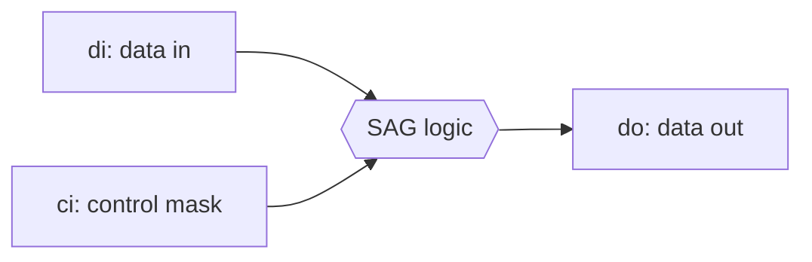
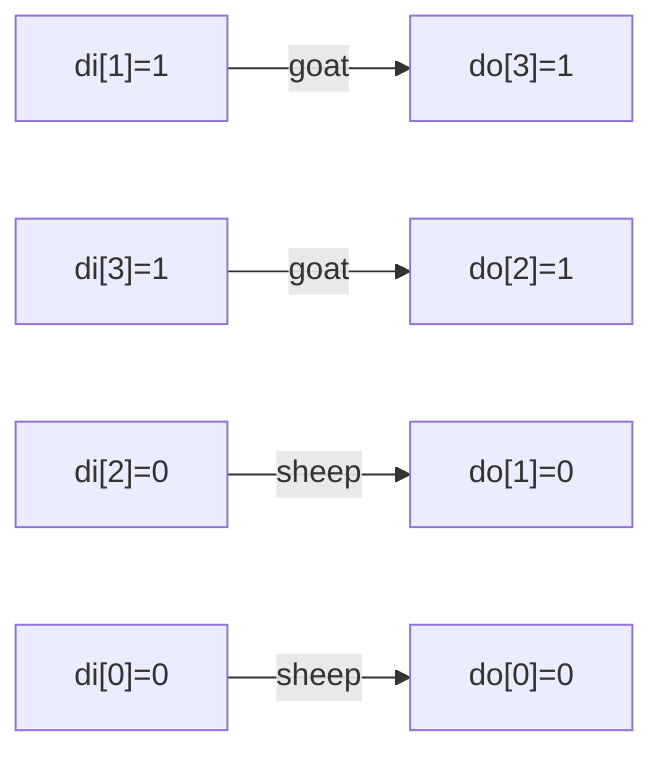
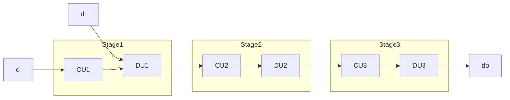

## Educational 8-Bit Sheep-And-Goats (SAG) Verilog Reference IP

This repository demonstrates how the Sheep-and-Goats (SAG) bit manipulation
primitive can be implemented in hardware.  Everything is hard coded to a small
8‑bit data path so the logic is easy to follow and experiment with.

SAG rearranges the bits of an input word `di` according to a mask `ci`. Bits
where `ci[i]` is `1` (the *sheep*) are moved to the low end of the result in
order. Bits where `ci[i]` is `0` (the *goats*) are placed in the remaining high
positions in reverse order. The operation behaves like a small sorting network
that separates sheep from goats.

### SAG at a glance



### Operation

For each bit `i` of `di`:
1. If `ci[i] = 1`, the bit is appended to the next free low position.
2. Otherwise the bit is appended to the next free high position, counting down
   from the most significant bit.

This results in all sheep packed at the front and all goats packed at the back
in mirrored order.

### Example

For a short 4-bit word `di = 4'b1010` and mask `ci = 4'b0101`, the sheep bits
(`di[2]` and `di[0]`) are packed to the low side while the goats fill in from
the high side:



The output in this case is `do = 4'b1100`.

### Hardware Pipeline

The Verilog implementation is organized as three identical stages. Each stage
contains a control unit that computes swap signals followed by a data unit that
applies those swaps.



Because the design is fixed at 8 bits, exactly three stages are required.

### Running the Testbench

A simple testbench in `top.v` exhaustively tests all `ci` and `di`
combinations. Use the provided script to run it:

```bash
./run.sh
```

The simulation produces verbose output and finishes with `ALL TESTS PASSED` when
no mismatches are found.
