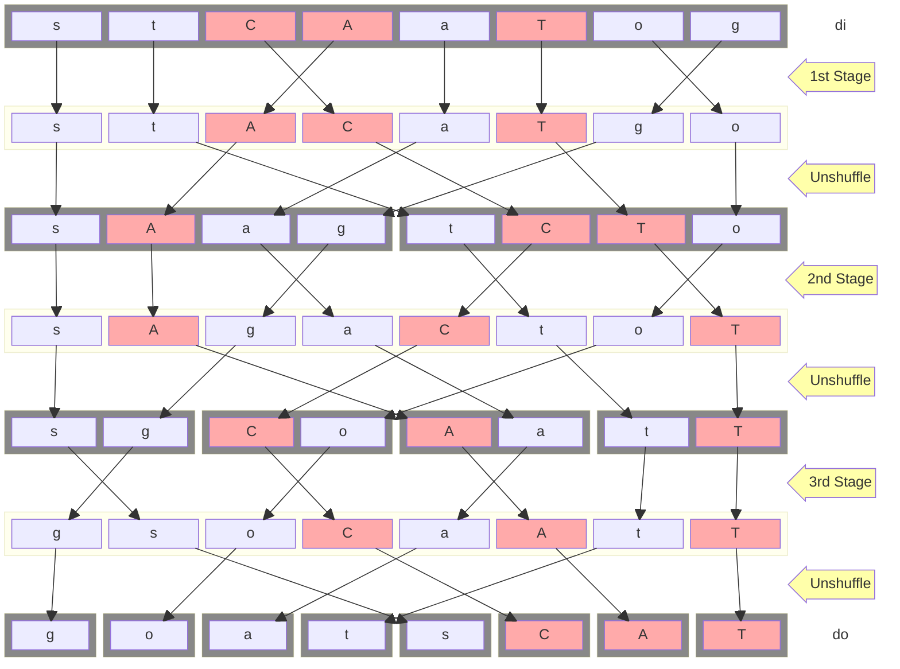

## Educational 8-Bit Sheep-And-Goats (SAG) Verilog Reference IP

The purpose of this design is to demonstrade the inner workings of an efficient SAG hardware IP.

Everything is hardcoded to 8-Bits (and thus 3-Stages) to keep the code as simple as possible.

### Functional Description of the Sheep-and-Goats (SAG) Operation

The Sheep-and-Goats (SAG) operation partitions and reorders the bits of a data
word `di` using a control mask `ci`. It outputs a new word where:

Bits of `di` selected by `ci` (i.e., where `ci[i] = 1`, the sheep) are packed
into the lower bits of the result, preserving their order.

The remaining bits of `di` (i.e., where `ci[i] = 0`, the goats) are packed into
the higher bits of the result in reversed order.

This creates a word where `di` is filtered and reorganized based on `ci`, with
a forward-ordered prefix of selected bits and a mirrored suffix of the rest.

