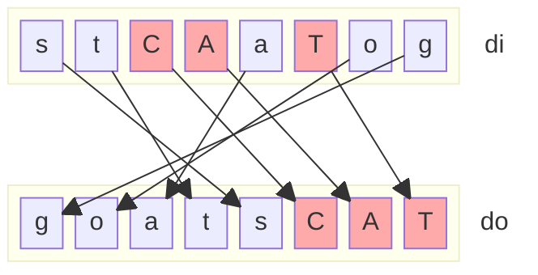
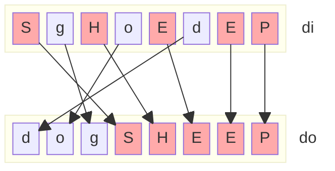
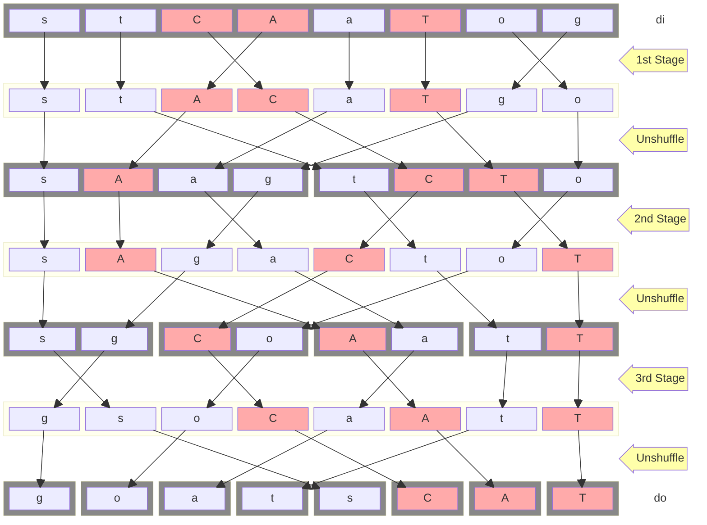
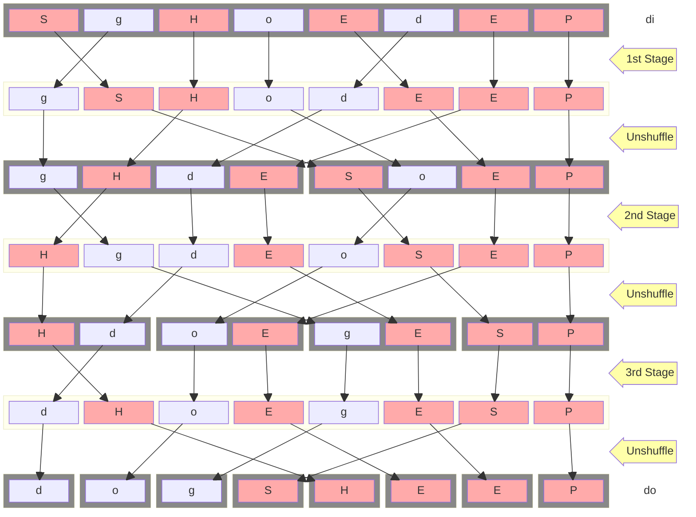

## Educational 8-Bit Sheep-And-Goats (SAG) Verilog Reference IP

The purpose of this design is to demonstrade the inner workings of an efficient SAG hardware IP.

Everything is hardcoded to 8-Bits (and thus 3-Stages) to keep the code as simple as possible.

### Functional Description of the Sheep-and-Goats (SAG) Operation

The Sheep-and-Goats (SAG) operation partitions and reorders the bits of a data
word `di` using a control mask `ci`. It outputs a new word where:

Bits of `di` selected by `ci` (i.e., where `ci[i] = 1`, the sheep) are packed
into the lower bits of the result, preserving their order.

The remaining bits of `di` (i.e., where `ci[i] = 0`, the goats) are packed into
the higher bits of the result in reversed order.

This creates a word where `di` is filtered and reorganized based on `ci`, with
a forward-ordered prefix of selected bits and a mirrored suffix of the rest.

In the following examples, upper case letters are the sheep (`ci[i] = 1`) and
lower case letters are the goats (`ci[i] = 0`).

### Principle of Operations

The method demonstrated in [sag.v](sag.v) is a divide and conquer-type approach to the problem, that is enabled by the following important property of the Sheep-And-Goats (SAG) operation with bit-reflection for the goats:

> **The most significant bit of the control word is not used.**

This is because no matter if the MSB bit is a sheep or goat, it's always going to end up between all the (other) goats and all the (other) sheep.

**Therefore we are free to pick whatever MSB bit-value in the control word is required, so that there's an even number of sheep (and thus, also and even number of goats).**

Because of this, because we can make it so that there's always an even number of sheep and goats, we get the following usefull property:

**Going through the control word from right to left, i.e. from LSB to MSB bits, and deciding for each pair of bits if it should be swapped based only of the fact if we have ecountered an even or odd number of set bits so far, is EQUIVALENT IN THE OVERLAPPING CASES to going from left to right and counting the zero bits.**

With *EQUIVALENT IN THE OVERLAPPING CASES* we refer to the fact that the "right-to-left" approach produces no constraints on a pair of zero bits, and the "left-to-right" approach produces no constraints on a pair of one bits.

However, there's no need to actually evaluate the control words in both directions in the actual core. Instead we only calculate the "right-to-left" XOR prefix-sum, and also use it to correctly calculate what to do with a pair of zero bits, as demonstrated in the core.

We do not need to explicitly set the "right" MSB bit of the control value in the core. Instead, we simply discard the MSB control bit and rely only on the XOR prefix sum of the other N-1 control bits.

Thus the method performs the following steps

1. Figure out for each pair of bits, if they should be swapped, based on the XOR prefix sum.

2. Swap both, the N/2 pairs of data bits, and the N/2 pairs of control bits, accordingly to the N/2 control signals produced by step 1.

3. "Unshuffle" both the control and the data bits. This means to place all the bits at even positions compressed to the right in the lower half of the output, and to place all the bits in odd positions into the higher half of the output. It is the inverse operation of the *perfect outer shuffle* of the bits in a word.

4. Divide and Conquer: Apply steps 1.-3. to the new data and control words, but instead of a XOR prefix sum over all bits, we now perform 2 XOR prefix sums, each covering a span of N/2 bits. And in the next iteration it's 4 XOR prefix sums, each covering N/4 bits, and so forth.

5. Stop after log2(N) iterations of steps 1.-3.

In the first iteration we put each data (and control) bit in the correct (even/odd) half of the word.

The unshuffle operations switches the roles of the bit-index-bits. I.e. for 8-bit words the unshuffle operation corresponds to a one-bit rotate right shift of the 3-bit bit-indices.) Note that an unshuffle opration does not require any active hardware elements, it's just crossing wires.

After the unshuffle we treat the even and odd halfs as completely seperate (upper and lower) N/2 half-words, and then effectively call the algorithm recursively on the two halfs, quartes, etc, until we have passed each bit-address-bit throught the zero position and have re-created the original bit-address-bit-ordering after log2(N) right-shifts of the log2(N) bit-address-bits.

----

And here is a picture of the complete data-flow through the SAG IP for the two examples shown above: 

----

